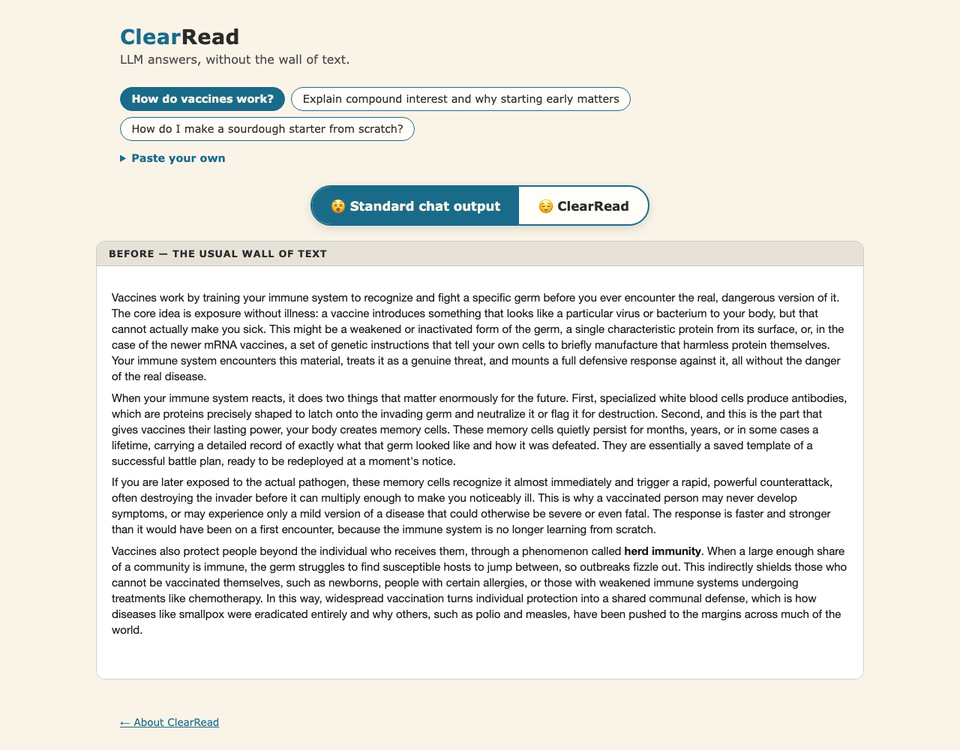
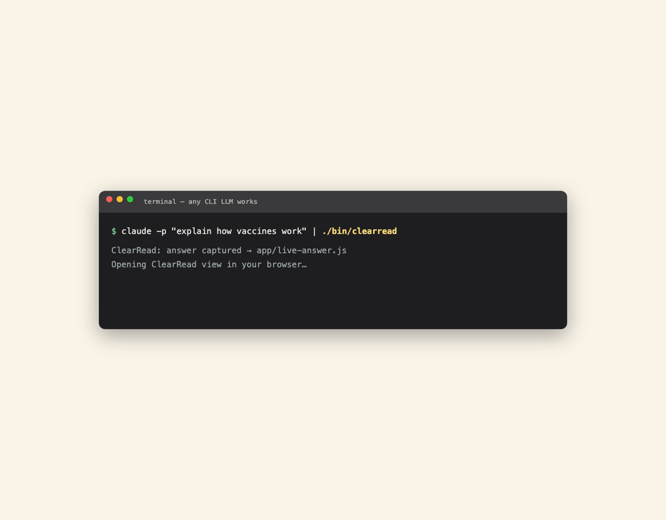

# ClearRead

LLM answers, without the wall of text.

**[Try it live](https://pheobe-sun.github.io/clearread/app/demo.html)** · [Project overview](https://pheobe-sun.github.io/clearread/)



The same answer, one click apart.

## Why

Dense text is hard for dyslexic readers. Long uniform paragraphs cause visual crowding, so the eye loses its place mid-line. Holding a wall of text in working memory is exhausting.

Yet every LLM ships its answers as exactly that: paragraph after paragraph of uniform text.

Existing tools swap the font or read the page aloud. None restructure the answer itself. ClearRead does.

## What it does

- **TL;DR first** — the main point in one plain sentence, before anything else.
- **Short chunks** — the answer is split into cards of 50 words or fewer, each with a bold gist line.
- **Tap to expand** — open any chunk when you want the detail.
- **🎯 Focus mode** — read one chunk at a time with Next/Back and a progress trail, so long answers never feel daunting.
- **Read aloud** — a 🔊 button per chunk, in any order you like. Uses your browser's built-in voice; optionally paste your own ElevenLabs API key in Voice settings for natural voices (the key stays in your browser's localStorage).
- **Evidence-based typography** — 66-character lines, 1.7 line-height, generous letter and word spacing, cream background.
- **Reader controls** — adjust spacing and type to suit you.

## The evidence

| Intervention | Source |
| --- | --- |
| Chunking content | W3C COGA |
| Lines ≤ 66 characters | WCAG 1.4.8 / BDA |
| Letter & word spacing | Zorzi 2012 (PNAS) + WCAG 1.4.12 |
| Summary first | W3C COGA (succinct text) |
| Bimodal read-aloud | Reading-comprehension studies |
| Cream background, left-align | BDA Style Guide 2023 |

One honest caveat: "dyslexia fonts" have weak evidence. Spacing beats fonts, so OpenDyslexic is an optional toggle only, never the default.

## Works with any LLM

ClearRead is a display layer, not a model. Paste any answer into the demo.

Or pipe one straight from a terminal:

```
claude -p "explain quantum computing" | ./bin/clearread
```

This works with any CLI that prints markdown — ollama, llm, and others.



### Claude Code integration

Deeper hookup for [Claude Code](https://claude.com/claude-code) users — no piping needed:

```
integrations/claude-code/clearread-last
```

opens your latest Claude Code answer in ClearRead (it reads the local session
transcript; nothing leaves your machine). An optional Stop hook opens every
answer automatically. See [integrations/claude-code/](integrations/claude-code/README.md).

## Quickstart

1. Clone this repo.
2. Open `app/demo.html` (or `index.html` for the overview).
3. Optional: pipe a live answer with `claude -p "..." | ./bin/clearread`.

## What's next / help wanted

- A browser extension for chat UIs.
- LLM-generated TL;DRs and chunk gists (today's gists are each chunk's opening sentence — honest, but a model could write true summaries).
- Word-level text-to-speech sync.
- Above all: user testing with dyslexic readers.

---

Built in a 90-minute human+AI sprint by Pheobe and Claude. MIT licensed.
